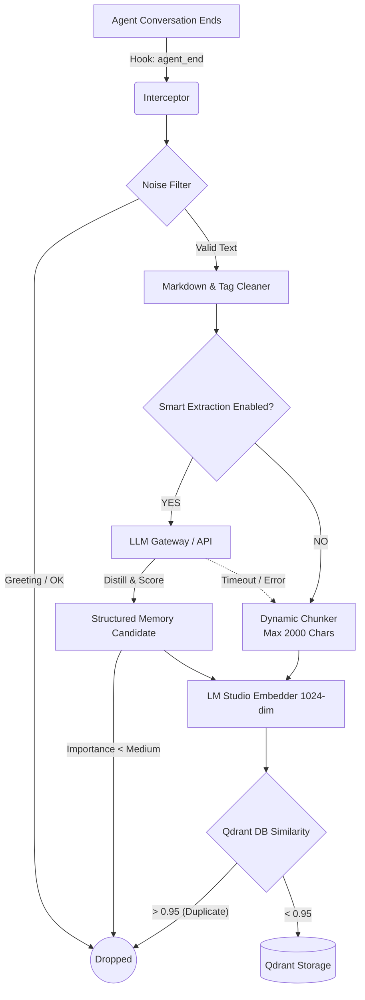

# openclaw-memory-qdrant (TrueRecall v3.1)

> **Semantic Memory System with Auto-Dream & Smart Extraction**
> 
> A robust, privacy-first semantic memory plugin built for OpenClaw. This plugin serves as the long-term memory engine for AI agents, featuring layered categorization, automated LLM distillation, and a self-maintaining "Auto-Dream" forgetting mechanism.
>
> 專為 OpenClaw 打造的在地化、隱私優先語義記憶外掛。本系統作為 AI 代理的長期記憶引擎，具備分層記憶、LLM 自動精煉，以及自我維護的「自動做夢 (Auto-Dream)」遺忘機制。

[繁體中文](README.md) | [English](README_EN.md)

   

---

## 🎯 解決的痛點 / Pain Points Solved

1. **Information Overload (資訊超載)**: 傳統記憶系統會盲目記錄所有對話，導致雜訊過多、向量檢索命中率低下。本系統引入 **Noise Filter (雜訊過濾)** 與 **Smart Extraction (智慧精煉)**，只儲存有價值的結構化記憶。
2. **Context Window Limits (上下文限制)**: 對話紀錄日積月累後塞滿 Prompt。本系統參考了 `CortexReach/memory-lancedb-pro` 的理念，採用安全的 **長文切割策略 (Dynamic Chunking)** 完美適應 8192Tokens 的本機模型，並藉由檢索僅注入最高相關性的 K 筆記錄。
3. **Memory Stagnation (記憶僵化)**: 舊記憶與無用資訊遲遲不被淘汰。獨創的 **Auto-Dream 機制** 會定時在背景透過「時間衰減」與「引用熱度」評分，自動將低分記憶打入冷宮 (Archive)。
4. **Privacy Concerns (隱私疑慮)**: 所有文本向量化 (Embedding) 完美相容本機端 LM Studio，確保你的個資、Token 與商業決策 100% 留存在本地端，不上雲。

---

## ⚙️ 核心原則與規格 / Constitution & Specifications

本系統的開發與運行嚴格遵循以下 Spec-Driven Development (SDD) 規格：

### 1. Privacy First (隱私優先)
* **規格 (Spec-01)**: 所有 Embedding 運算與 Qdrant 儲存皆強制於本地執行 (Local Network)。無對外 API 硬依賴。

### 2. Signal-to-Noise Ratio (高訊噪比)
* **規格 (Spec-02)**: 強制攔截瑣碎對話。所有對話內容必須通過長度檢測與啟發式過濾，方可進入儲存管線。
* **規格 (Spec-03)**: (可選) 啟用 LLM Smart Extraction 後，記憶將強制被分類並評估重要性 (Importance)，低重要性者自動捨棄。記憶強制歸類為 6 大精準範圍 (`profile`, `preferences`, `entities`, `events`, `cases`, `patterns`)。

### 3. Self-Maintenance (自我維護)
* **規格 (Spec-04)**: 自動根據過去 180 天的「參照次數 (Reference Count)」與「時間衰減 (Recency)」為記憶評分，綜合低於 0.3 分且超過 90 天未調用者，自動標示為 `archived`（隱藏），不再干擾日常檢索。

---

## 🏗 系統架構與流程 / Architecture & Flow

為了提供最直觀的理解，本系統的核心架構分為「入口層」與「處理管線」。



### 處理管線細節 (Pipeline Details)

當一段對話結束，系統將自動啟動以下處理管道：

1. **攔截與預處理 (Intercept & Preprocess)**
   * 系統只抓取最後一輪最新對話。
   * 通過雙語雜訊過濾器（剔除 Greeting, OK, Agent Exceptions, Slash commands 等系統雜訊）。
   * 洗刷 Markdown 格式殘留並去除 `<relevant-memories>` 注入痕跡，保留最真實的對話紀錄。

2. **處理分歧點 (Processing Fork)**
   * **智慧精煉模式 (Smart Extraction)**：當啟用且 LLM 正常時，透過 Gateway 端點將對話濃縮為結構化記憶，並給予重要性權重。
   * **原文模式 (Raw Fallback)**：當 LLM 失效 (Graceful Degradation) 或是未啟用精煉時，啟用文字安全切塊 (Chunking)，單塊最高容量提昇至 2000 字元以對齊 8192Tokens 長文模型。

3. **向量化與寫入 (Embed & Store)**
   * 將處理好的字串發送至 LM Studio 轉換為高維度向量。
   * 進入 Qdrant Database 進行相似度掃描，若相似度超過 0.95 閾值則觸發去重 (Dedup) 丟棄。
   * 正式寫入資料庫，完成記憶固化。

---

## 🆚 架構對比表 / Design Comparison

| 特性 (Feature) | 傳統 RAG 記憶系統 | 本外掛 (TrueRecall v3.1) | CortexReach (memory-lancedb-pro) 參考 |
|---------------|-------------------|-------------------------|--------------------------------------|
| **儲存方式** | 盲目全文儲存 | 雜訊過濾 + LLM 精煉提存 | 全文切割儲存 + 大語言模型再處理 |
| **長文處理** | 固定 500 tokens | 動態高達 2000字元 + CJK 安全計算 | 支援 8192Tokens 與句子邊界切斷 |
| **檢索機制** | 單純 Vector Search | Vector Search 配合自動做夢遺忘機制 | 向量加關鍵字的 Hybrid Search (BM25) |
| **資料庫引擎**| 雲端 Pinecone / 等 | 完全地端 Qdrant (Docker) | 本地端 LanceDB |

---

## 📦 安裝與設定 / Installation & Setup

### 1. 環境需求 (Prerequisites)
- **Local LLM**: 開啟 [LM Studio](https://lmstudio.ai/) 的 Local Server (預設 port: 1234)，並載入 Embedding 模型 (推薦: `snowflake-arctic-embed-2.0`，**請將 Context Length 設為 8192**)。
- **Vector DB**: 啟動 [Qdrant](https://qdrant.tech/) 伺服器：
  `docker run -p 6333:6333 qdrant/qdrant`

### 2. 安裝外掛 (Install Plugin)
進入專案資料夾並安裝 Node 相依套件：
```bash
cd <您的外掛路徑>/memory-qdrant
npm install
```

### 3. 配置參數 (Configuration)
在你的 `~/.openclaw/openclaw.json` (或等效的主設定檔) 中，配置記憶體模組的區塊：

```json
{
  "plugins": {
    "allow": ["memory-qdrant"],
    "slots": {
      "memory": "memory-qdrant"
    },
    "entries": {
      "memory-qdrant": {
        "enabled": true,
        "config": {
          "qdrantUrl": "http://127.0.0.1:6333",
          "embeddingBaseUrl": "http://127.0.0.1:1234/v1",
          
          "autoCapture": true,
          "autoDreamInterval": "24h",   // Auto-Dream 自動遺忘機制執行週期
          
          "smartExtraction": true,      // 啟用 LLM 智慧精煉
          "extractionLlmBaseUrl": "http://localhost:18789/v1",
          "extractionLlmModel": "Doubao-Seed-2.0-Code"
        }
      }
    }
  }
}
```

最後，重啟 Gateway 讓外掛載入：
```bash
openclaw gateway restart
```

---

## 🛠 互動與模組 / Capabilities

- **純背景被動捕捉 (Passive Capture)**: 主程式隱藏於背景，無需任何人工干預即可自動完備大腦知識庫。
- **手動/定時夢境 (Auto-Dreaming)**: 可被動等待 `24h` 執行，也可透過 CLI 強制觸發 `openclaw memory-qdrant dream` 來整理老舊記憶。
- **主動查詢指令 (Active Commands)**: 
  - Discord/UI 對話窗內支援 `/recall [關鍵字]` 直接提取關聯記憶。
- **MCP 支援 (MCP Integrations)**: 向其他 Agent 暴露核心工具，支援跨 Agent 呼叫 `memory_store`, `memory_search`, `memory_forget`。

---
`License: MIT`
