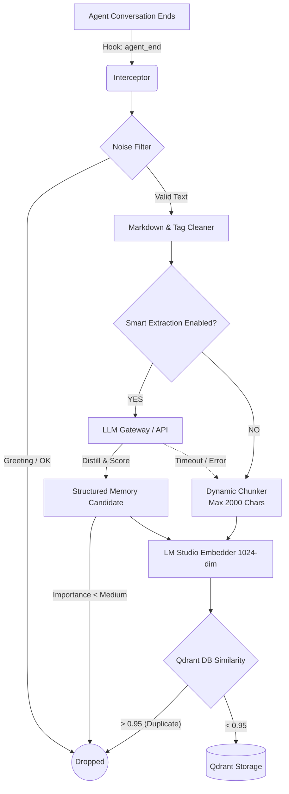

# openclaw-memory-qdrant (TrueRecall v3.1)

> **Semantic Memory System with Auto-Dream & Smart Extraction**
> 
> A robust, privacy-first semantic memory plugin built for OpenClaw. This plugin serves as the long-term memory engine for AI agents, featuring layered categorization, automated LLM distillation, and a self-maintaining "Auto-Dream" forgetting mechanism.

[繁體中文](README.md) | [English](README_EN.md)

   

---

## 🎯 Pain Points Solved

1. **Information Overload**: Traditional memory systems blindly record all conversations, leading to excessive noise and poor vector retrieval hit rates. This system introduces **Noise Filters** and **Smart Extraction**, stringently storing only valuable, structured memories.
2. **Context Window Limits**: As conversation history piles up, the prompt becomes saturated. Inspired by the dynamic chunking strategy of `memory-lancedb-pro`, this plugin employs a robust chunking strategy specifically optimized for 8192-tokens local models, fetching only the highest-relevance K-records.
3. **Memory Stagnation**: Unique to TrueRecall, the **Auto-Dream** background mechanism evaluates memory vitality based on 'Recency' and 'Reference Count'. It automatically archives low-score, unused memories to ensure retrieval accuracy.
4. **Privacy Concerns**: 100% cloud-free. The entire Embedding process is perfectly compatible with your local LM Studio instance, ensuring your tokens, personal data, and business logic stay entirely on your local machine.

---

## ⚙️ Constitution & Specifications

This system adheres to the Spec-Driven Development (SDD) standard:

### 1. Privacy First
* **(Spec-01)**: All Embedding calculations and Qdrant database writing operations execute strictly on the Local Network. Zero reliance on external cloud APIs.

### 2. Signal-to-Noise Ratio 
* **(Spec-02)**: Forceful interception of trivial conversations. Conversation chunks must pass length evaluations and heuristic filters before entering the storage pipeline.
* **(Spec-03)**: When LLM Smart Extraction is enabled, candidate memories are assigned an *Importance* score. Low importance data is discarded, while accepted memories are classified into 6 precise categories (`profile`, `preferences`, `entities`, `events`, `cases`, `patterns`).

### 3. Self-Maintenance
* **(Spec-04)**: Memories unreferenced for > 90 days and carrying a Reference/Time score < 0.3 are automatically labeled as `archived` by the Auto-Dream task. Archived memories are hidden from daily indexing but safely kept for manual reviews.

---

## 🏗 Architecture & Flow

To provide the most intuitive understanding, the system is divided into an Interception Layer and a Processing Pipeline.



### Pipeline Details

Upon conversation conclusion, the system initiates the pipeline:

1. **Intercept & Preprocess**: Grabs the last conversation cycle, scrubs it against a bilingual Noise Filter, and standardizes the markdown format (removing injected `<relevant-memories>` traces).
2. **Processing Fork**:
   * **Smart Extraction**: Routes the text to a local LLM through the Gateway to distill the conversation into high-weight, structured memory facts.
   * **Raw Fallback**: Ensures Graceful Degradation. If the LLM is down (or feature is disabled), the system safely partitions the raw text into chunks up to 2000 CJK characters to utilize the 8192-token context limit safely.
3. **Embed & Store**: Forwards processed strings into the LM Studio 1024-dim embedding model. A similarity threshold scan against Qdrant prevents near-identical duplication (>0.95). 

---

## 🆚 Design Comparison

| Feature | Standard RAG Memory | TrueRecall v3.1 | CortexReach (memory-lancedb-pro) Reference |
|---------|---------------------|-----------------|------------------------------------------|
| **Storage Strategy** | Blind full-text storage | Noise Filtering + LLM Distillation | Full-text chunking + LLM post-processing |
| **Max Context** | Fixed 500 tokens | Dynamic 2000 chars + CJK alignment | Full 8192Tokens + Sentence boundary splits |
| **Retrieval Mode** | Pure Vector Search | Vector Search + Auto-Dreaming Forgetting | Hybrid Search (BM25 + Semantic Vector) |
| **Database Engine**| Cloud (Pinecone, etc.) | 100% Local Qdrant Engine | 100% Local LanceDB Engine |

---

## 📦 Installation & Setup

### 1. Prerequisites
- **Local LLM**: Start an [LM Studio](https://lmstudio.ai/) Local Server (default: 1234), loading a recommended Embedding model (e.g. `snowflake-arctic-embed-2.0` with Context Length set to 8192).
- **Vector DB**: Spin up a [Qdrant](https://qdrant.tech/) container instance:
  `docker run -p 6333:6333 qdrant/qdrant`

### 2. Install Plugin
```bash
cd <your_plugin_directory>/memory-qdrant
npm install
```

### 3. Configuration
Adjust your main OpenClaw profile configuration (e.g., `~/.openclaw/openclaw.json`):

```json
{
  "plugins": {
    "allow": ["memory-qdrant"],
    "slots": {
      "memory": "memory-qdrant"
    },
    "entries": {
      "memory-qdrant": {
        "enabled": true,
        "config": {
          "qdrantUrl": "http://127.0.0.1:6333",
          "embeddingBaseUrl": "http://127.0.0.1:1234/v1",
          
          "autoCapture": true,
          "autoDreamInterval": "24h",
          
          "smartExtraction": true, 
          "extractionLlmBaseUrl": "http://localhost:18789/v1",
          "extractionLlmModel": "Doubao-Seed-2.0-Code"
        }
      }
    }
  }
}
```

Restart to apply plugin rules:
```bash
openclaw gateway restart
```

---

## 🛠 Capabilities

- **Passive Capture**: Runs purely in the background to build the agent's knowledge base without disruptive delays.
- **Auto-Dreaming**: Auto-maintains the database every 24h, or can be triggered via CLI.
- **Active Commands**: Supports standard `/recall [keyword]` within UI/Discord chats.
- **MCP Integrations**: Exposes standard methods (`memory_store`, `memory_search`, `memory_forget`) to other Agents.

---
`License: MIT`
