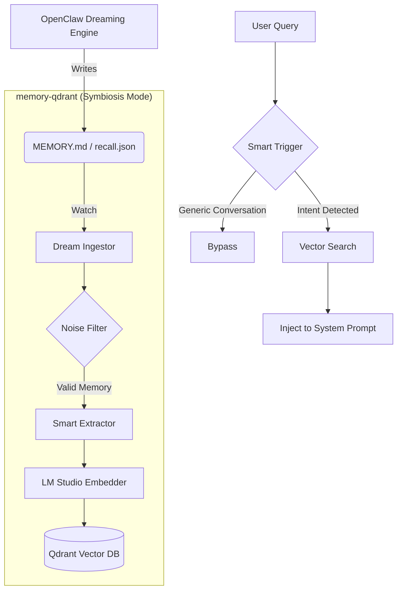

# openclaw-memory-qdrant (TrueRecall v3.1)

> **Semantic Memory System with Auto-Dream & Smart Extraction**
> 
> A robust, privacy-first semantic memory plugin built for OpenClaw. This plugin serves as the long-term memory engine for AI agents, featuring layered categorization, automated LLM distillation, and a self-maintaining "Auto-Dream" forgetting mechanism.

[繁體中文](README.md) | [English](README_EN.md)

   

---

## 🎯 Pain Points Solved

1. **Information Overload**: Traditional memory systems blindly record all conversations, leading to excessive noise and poor vector retrieval hit rates. This system introduces **Noise Filters** and **Smart Extraction**, stringently storing only valuable, structured memories.
2. **Context Window Limits**: As conversation history piles up, the prompt becomes saturated. Inspired by the dynamic chunking strategy of `memory-lancedb-pro`, this plugin employs a robust chunking strategy specifically optimized for 8192-tokens local models, fetching only the highest-relevance K-records.
3. **Memory Stagnation**: Integrated with OpenClaw's native **Dreaming mode**, this plugin no longer maintains its own forgetting schedule. Instead, it reactively ingests processed memories from the workspace, ensuring the vector store is always in sync with the agent's consolidated "dreams".
4. **Privacy Concerns**: 100% cloud-free. The entire Embedding process is perfectly compatible with your local LM Studio instance, ensuring your tokens, personal data, and business logic stay entirely on your local machine.

---

## ⚙️ Constitution & Specifications

This system adheres to the Spec-Driven Development (SDD) standard:

### 1. Privacy First
* **(Spec-01)**: All Embedding calculations and Qdrant database writing operations execute strictly on the Local Network. Zero reliance on external cloud APIs.

### 2. Signal-to-Noise Ratio 
* **(Spec-02)**: Forceful interception of trivial conversations. Conversation chunks must pass length evaluations and heuristic filters before entering the storage pipeline.
* **(Spec-03)**: When LLM Smart Extraction is enabled, candidate memories are assigned an *Importance* score. Low importance data is discarded, while accepted memories are classified into 6 precise categories (`profile`, `preferences`, `entities`, `events`, `cases`, `patterns`).

### 3. Self-Maintenance
* **(Spec-04)**: Memories unreferenced for > 90 days and carrying a Reference/Time score < 0.3 are automatically labeled as `archived` by the Auto-Dream task. Archived memories are hidden from daily indexing but safely kept for manual reviews.

---

## 🏗 Architecture & Flow

To provide the most intuitive understanding, the system is divided into an Interception Layer and a Processing Pipeline.



### Pipeline Details

Upon conversation conclusion, the system initiates the pipeline:

1. **Dream Ingestion**: The plugin monitors `MEMORY.md` and `short-term-recall.json` in the OpenClaw workspace. It reactively parses new content as it is generated by the native Dreaming engine.
2. **Smart Triggering**: Instead of searching on every turn, the system analyzes user intent. Memory retrieval is only triggered when the user explicitly asks about past events or needs specific project context.
3. **Embed & Store**: Extracted segments are forwarded to LM Studio for vectorization and stored in Qdrant with deduplication logic.
---

## 🆚 Design Comparison

| Feature | Standard RAG Memory | TrueRecall v3.1 | CortexReach (memory-lancedb-pro) Reference |
|---------|---------------------|-----------------|------------------------------------------|
| **Storage Strategy** | Blind full-text storage | Noise Filtering + LLM Distillation | Full-text chunking + LLM post-processing |
| **Max Context** | Fixed 500 tokens | Dynamic 2000 chars + CJK alignment | Full 8192Tokens + Sentence boundary splits |
| **Retrieval Mode** | Pure Vector Search | Vector Search + Auto-Dreaming Forgetting | Hybrid Search (BM25 + Semantic Vector) |
| **Database Engine**| Cloud (Pinecone, etc.) | 100% Local Qdrant Engine | 100% Local LanceDB Engine |

---

## 📦 Installation & Setup

### 1. Prerequisites
- **Local LLM**: Start an [LM Studio](https://lmstudio.ai/) Local Server (default: 1234), loading a recommended Embedding model (e.g. `snowflake-arctic-embed-2.0` with Context Length set to 8192).
- **Vector DB**: Spin up a [Qdrant](https://qdrant.tech/) container instance:
  `docker run -p 6333:6333 qdrant/qdrant`

### 2. Install Plugin
```bash
cd <your_plugin_directory>/memory-qdrant
npm install
```

### 3. Configuration
Adjust your main OpenClaw profile configuration (e.g., `~/.openclaw/openclaw.json`):

```json
{
  "plugins": {
    "allow": ["memory-qdrant"],
    "slots": {
      "memory": "memory-qdrant"
    },
    "entries": {
      "memory-qdrant": {
        "enabled": true,
        "config": {
          "qdrantUrl": "http://127.0.0.1:6333",
          "collectionName": "memories_tr",
          "embeddingBaseUrl": "http://127.0.0.1:1234/v1",
          "embeddingModelId": "text-embedding-desu-snowflake",
          "embeddingModelDimension": 1024,
          
          "smartExtraction": true,
          "extractionLlmBaseUrl": "http://localhost:18789/v1",
          "extractionLlmModel": "Doubao-Seed-2.0-Code",
          "extractionMaxChars": 8000
        }
      }
    }
  }
}
```

Restart to apply plugin rules:
```bash
openclaw gateway restart
```

#### Detailed Parameters

| Parameter | Description | Default |
| :--- | :--- | :--- |
| `qdrantUrl` | Qdrant Database API endpoint | `http://127.0.0.1:6333` |
| `collectionName` | The name of the memory collection | `memories_tr` |
| `embeddingBaseUrl` | Embedding model (LM Studio) API endpoint | `http://127.0.0.1:1234/v1` |
| `embeddingModelId` | Vector model name | `(Snowflake 2.0)` |
| `embeddingModelDimension` | Vector dimension (Snowflake is 1024) | `1024` |
| `autoCapture` | Automatically capture memories when conversation ends | `true` |
| `autoDreamInterval` | Interval for Auto-Dream (Dedup/Score/Forget) | `24h` |
| `smartExtraction` | Enable LLM Smart Extraction (distill to facts) | `false` |
| `extractionLlmBaseUrl` | **[NEW]** API endpoint for Extraction LLM (can be separate) | `http://localhost:18789/v1` |
| `extractionLlmModel` | **[NEW]** LLM name for Extraction (recommend strong models) | `Doubao-Seed-2.0-Code` |
| `extractionMaxChars` | **[NEW]** Max chars sent to LLM per extraction | `8000` |

---

## 🛠 Capabilities

- **Symbiotic Ingestion (Dream Ingestor)**: Replaces blind `autoCapture`. It monitors native OpenClaw Dreaming files (`MEMORY.md` & `recall.json`) to ingest consolidated insights.
- **Intent-Based Retrieval (Smart Trigger)**: Analyzes user intent via heuristics. Retrieval is only triggered when the user explicitly asks for memories (e.g., "What did we discuss last time?"), significantly reducing token overhead.
- **Active Commands**: 
  - Supports standard `/recall [keyword]` within UI/Discord chats to fetch semantic memories.
- **AI Agent Tools**: 
  - `memory_store`: Structurally store new memories.
  - `memory_search`: Semantic search for relevant context.
  - `memory_list_by_date`: **[NEW]** Precision date retrieval. Supports cross-date buffering and noise filtering, perfect for automated daily diary summaries.
  - `memory_forget_by_id`: Precisely delete specific entries.

---
`License: MIT`
